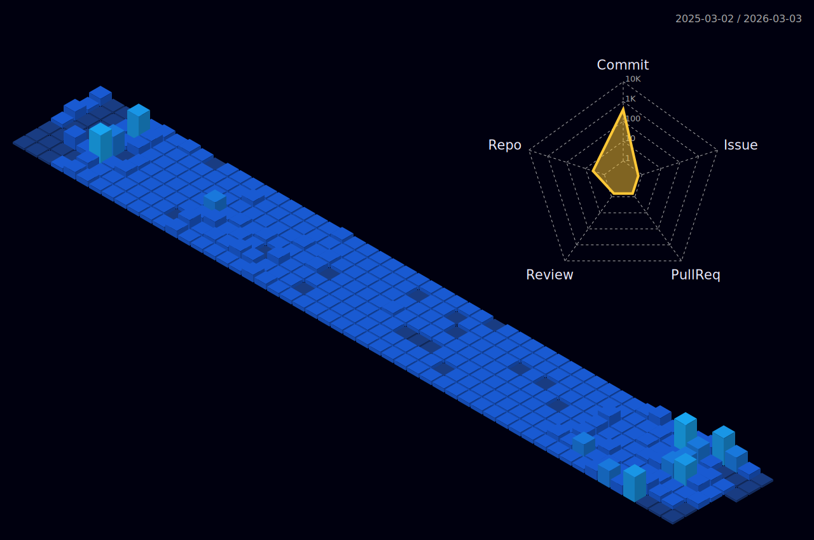

<h1 
align="left">MoHanQing | 
</h1>

<p align="center">
  
</p>

---

### 📊 GitHub Stats

<p align="center">
  
  
</p>

<!-- Streak stats disabled due to service instability. If you deploy your own streak-stats, update the URL here. -->
<!--
<p align="center">
  
</p>
-->

---

### 🧊 3D Contributions

<p align="center">
  
</p>

---

### ⏳ Weekly Activity

<p align="center">
  
</p>

<!-- START_SECTION:waka -->

```rust
From: 29 January 2026 - To: 05 February 2026

Total Time: 9 hrs 8 mins

Java              6 hrs 33 mins   >>>>>>>>>>>>>>>>>>-------   71.81 %
Vue.js            37 mins         >>-----------------------   06.84 %
XML               37 mins         >>-----------------------   06.79 %
Markdown          24 mins         >------------------------   04.54 %
JavaScript        14 mins         >------------------------   02.70 %
Kotlin            12 mins         >------------------------   02.26 %
SQL               8 mins          -------------------------   01.62 %
GitIgnore file    3 mins          -------------------------   00.55 %
Java Properties   0 secs          -------------------------   00.12 %
```

<!-- END_SECTION:waka -->

